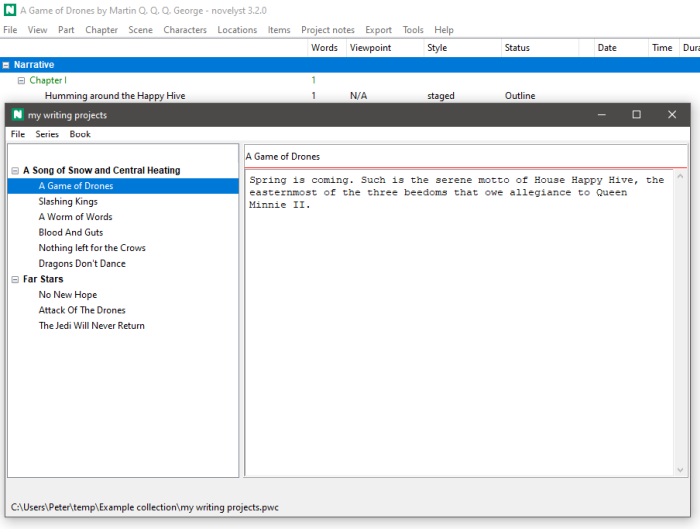

# novelyst_collection

The [novelyst](https://peter88213.github.io/novelyst/) Python program helps authors organize novels.  

*novelyst_collection* is a plugin providing a book/series collection manager. 

## Features

- Show a tree with series and books.
- Each book can stand alone, or belong to a series.
- Show book/series title and description.
- Load the selected book into novelyst by double-click. 
- Handle multiple collections, represented by XML files with the extension *.pwc*.

## Requirements

- [novelyst](https://peter88213.github.io/novelyst/) version 4.19+

## Download and install

[Download the latest release (version 4.3.11)](https://github.com/peter88213/novelyst_collection/raw/main/dist/novelyst_collection_v4.3.11.zip)

- Extract the "novelyst_collection_v4.3.11" folder from the downloaded zipfile "novelyst_collection_v4.3.11.zip".
- Move into this new folder and launch **setup.pyw**. This installs the plugin for the local user.

---

[Changelog](changelog)

## Usage

See the [instructions for use](usage)

## License

This is Open Source software, and the *novelyst_collection* plugin is licensed under GPLv3. See the
[GNU General Public License website](https://www.gnu.org/licenses/gpl-3.0.en.html) for more
details, or consult the [LICENSE](https://github.com/peter88213/novelyst_collection/blob/main/LICENSE) file.
